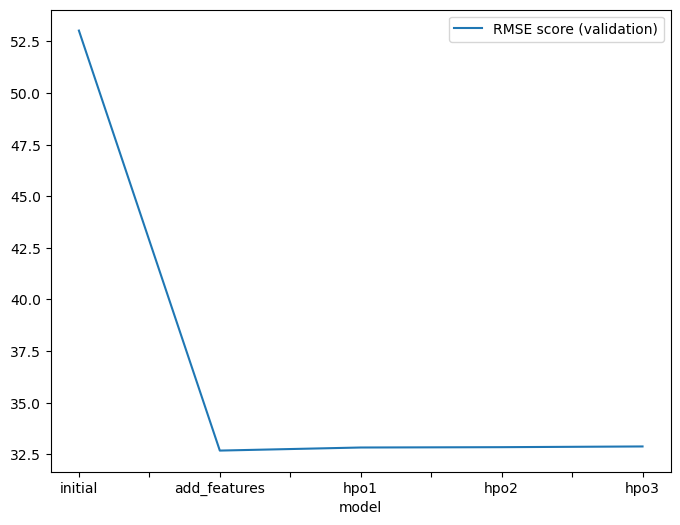
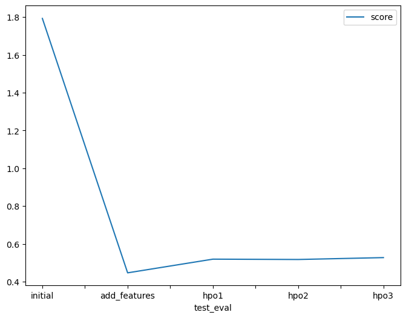
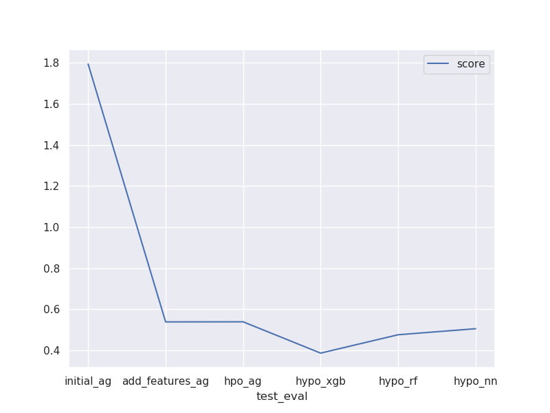

# Report: Predict Bike Sharing Demand with AutoGluon Solution
#### ARNIT PANDA

## Initial Training
### What did you realize when you tried to submit your predictions? What changes were needed to the output of the predictor to submit your results?

**Nine different experiments were performed as follows:
(first 6 belongs to <a href="https://github.com/Arnit9/Udacity-ML-project-starter/blob/master/project/project-notebook(Auto-Gluon).ipynb" target="_blank">AutoGluon Model Notebook</a> and the other 3 belongs to <a href="https://github.com/Arnit9/Udacity-ML-project-starter/blob/master/project/Project%20Stand%20Out_Notebook(diff_models).ipynb" target="_blank">Other Models Notebook(Stand Out)</a>)**

1. Initial Raw Submission   **[Model: `initial`]**
2. Added Features Submission *(EDA +  Feature Engineering)* **[Model: `add_features`]**
3. Hyperparameter Optimization (hpo1) - Initial Setting Submission 
4. Hyperparameter Optimization (hpo2) - Setting 2 Submission 
5. Hyperparameter Optimization (hpo3) - Setting 3 Submission
6. Hyperparameter Optimization (hpo) - Auto Setting Submission **[Model: `hpo (top-hpo-model: hpo)`]**
7. XGBoost HPO Submission **[Model: `hpo (best-model: hpo)`] among all models**
8. Random Forest Regression	HPO Submission
9. Neural Network HPO Submission

**Observation:** While submitting predictions, some of the experiments delivered negative predictions values. 
So, Kaggle refuses the submissions containing negative predictions values obtained from the predictor. Hence, all such negative outputs from respective predictors were replaced with 0. 

### What was the top ranked model that performed?
The `top-ranked model` was the `(add features) model` hyperparameter optimization of `XGBoost model`, with the best **Kaggle score** of **0.38604** (on the test dataset). Without employing a hyperparameter optimisation process, this model was created by training on data that was gathered through exploratory data analysis (EDA) and feature engineering. Upon hyperparameter-optimization, some models did show improved RMSE scores on validation data; some models show little less score as of `add_features-model`; however this model delivered the best performance on unseen test dataset. The selection was made after taking into account the RMSE (cross-validation) and Kaggle (test data) scores, as many models offered competitive performance.

**Observation:** The autogluon programme expects the RMSE scores in the jupyter notebook to be multiplied by a factor of "-1" in order to get the precise RMSE scores, and it further expects them to be negative in order to rank them in terms of highest scores.  Values in the Jupyter notebook may look as negative RMSE values since autogluon adheres to this method.

## Exploratory data analysis and feature creation
### What did the exploratory analysis find and how did you add additional features?
**For AutoGluon Notebook:**
- Feature `datetime` was parsed as a datetime feature to obtain hour information from timestamp
- Independent features `season` and `weather` were initially read as `integer`. Since these are categorical variables, they were transformed into `category` data type.
- The data for `year`, `month`, `day` *(dayofweek)* and `hour` were extracted as distinct independent features from the `datetime` feature using feature extraction. Upon feature extraction, `datetime` feature was dropped. 
- After probing and considering the features, `casual` and `registered`, it was noticed that the RMSE scores improved significantly during cross-validation and these independent features were highly co-related to the target variable `count`. However, the features `casual` and `registered` are only present in the train dataset and absent in the test data; hence, these features were ignored/dropped during model training
- Moreover, features `temp` (temperature in degree Celsius) and `atemp` (*'feels like'* temperature in degree Celsius) had a `high positive correlation of 0.98`. Hence, in order to reduce multicollinearity between independent variables, `atemp` was dropped from the train and test datasets respectively.
- Further, data visualization was conducted to derive insights from the features.

**For Other-Models Notebook:**
- *Histogram* of different features were plotted and obsereved to see variations like `seasons` and `weather` belong to categorical features due to limited value_counts or logically also. `holiday` and `workingday` features are one-hot encoded columns with 0 and 1
- *Correlation(Heatplot) Matrix* was plotted to observe the dependency ratio between two features among all. `temp` and `atemp` features are highly correlated with a positive correlation of 0.97. `casual` and `registered` are also highly correlated to the target- `count`.
- The data for `year`, `month`, `day` *(dayofweek)* and `hour` were extracted as distinct independent features from the `datetime` feature as done before and histogram plot of all features were analyzed.
- *Outliers* of few features were obsereved through boxplot and the `count` variable contains lot of outlier data points which skews the distribution towards right. So, the outliers are removed to avoid large variations which might occur during training.
- Data visualization was conducted to derive meaningful insights from the features through different plots and some independent features like `casual` and `registered` were dropped.
- It was observed that many people, regardless of their registration status, tend to rent bicycles between 10AM and 4PM. This trend is likely due to the fact that people are more likely to use bicycles for leisure activities during this time of the day.
- On weekdays, the peak rental count around 7AM-8AM and 5PM-6PM is primarily contributed by registered users. This makes sense as most people who rent these bikes could potentially be young college students or working professionals, who actively commute via some means of transport during peak hours of the day.

### How much better did your model preform after adding additional features and why do you think that is?
- The addition of additional features `improved model performance by approximately 70%` in comparison to the initial/raw model (without EDA and/or feature engineering) performance.
- The model performance improved after converting certain categorical variables with `integer` data types into their true `categorical` datatypes. 
- In addition to ignoring `casual` and `registered` features during model training, even `atemp` was dropped from the datasets, as it was highly correlated to another independent variable `temp`. This assisted in reducing multicollinearity.
- Moreover, splitting the `datetime` feature into multiple independent features such as `year`, `month`, `day` and `hour` along with the addition of dummy variables of `season` and `weather`, further improved the model performance.
- These predictor variables `aid the model assess seasonality or historical patterns in the data` more effectively.
- At one case, it was seen that on having many columns of on-hot-encoded dummy variables, the AutoGluon model shows comparatively poor performance. This didn't happen in case of other 3 models where the score was comparatively better than the AutoGluon models. 

## Hyper parameter tuning
### How much better did your model preform after trying different hyper parameters?
- AutoGluon Hyperparameter tuning was beneficial upto some extent because it enhanced the model's performance compared to the initial submission. Four different configurations were used while performing hyperparameter optimization experiments. The model with EDA and extra features performed significantly better on the Kaggle (test) dataset, despite hyperparameter optimised models delivering competitive performances in comparison. On 3 cases, the results were better than inital but they're going abnormal on increasing with parameter values.
- XGBoost Hyperparameter tuning was the best among all model where the best parameters were obtained through trial-and-error method and successive iterations. Similarly, the Random Forest Regression and Neural Network- hyperparameter optimization shows much better score but among all XGBoost model gives the top-model-score.  

### If you were given more time with this dataset, where do you think you would spend more time?
- I would like to investigate additional potential outcomes when AutoGluon is run for an extended period with a high quality preset and enhanced hyperparameter tuning.
- I would like to go for further feature extraction so that more features could be added through any means of correlation of any dependency that might improves the score of the model.
- I would prefer a few more models to experiment on and optimize the hyperparameters through iterative training to observe whether the model is learning or performing well.

### Create a table with the models you ran, the hyperparameters modified, and the kaggle score.
|model|hpo1|hpo2|hpo3|score|
|--|--|--|--|--|
|initial|prescribed_values|prescribed_values|"presets: 'high quality' (auto_stack=True)"|1.79438|
|add_features|prescribed_values|prescribed_values|"presets: 'high quality' (auto_stack=True)"|0.53813|
|autogluon-hpo|prescribed_values|num_bag_folds, num_bag_sets, num_stack_levels|hyperparameter_tune_kwargs='auto'|0.53854|
|xgboost-hpo|n_estimators|max_depth|learning_rate|0.38604|
|rf-hpo|n_estimators|n_jobs|max_features|0.47553|
|nn-hpo|keras-dense-layers|activation_function|optimizer|0.50491|

### Create a line plot showing the top model score for the three (or more) training runs during the project.

### Create a line plot showing the top kaggle score for the three (or more) prediction submissions during the project.

## Summary
- This bike sharing demand forecast project has carefully examined and included the AutoGluon AutoML framework for Tabular Data.
- By utilising data from rigorous exploratory data analysis (EDA) and feature engineering without hyperparameter optimisation, the top-ranked AutoGluon-based model greatly improved results.
- Addtionally, hyperparameter tuning using AutoGluon also offered improved performance over the initial raw submission; but it wasn't better than that of the model with EDA, feature engineering (with no hyperparameter tuning).  
- It was noticed that on increasing feature columns through dummy variables, the XGBoost model along with hyperparameter optimization performed the best where in the case of AutoGluon model, it shows even worse score than the normal added features model.
- The top-ranked model was the (`extra added features`) **XGBoost** model with hyperparameters, with the best Kaggle score of **0.38604** (on test dataset) among all other models.